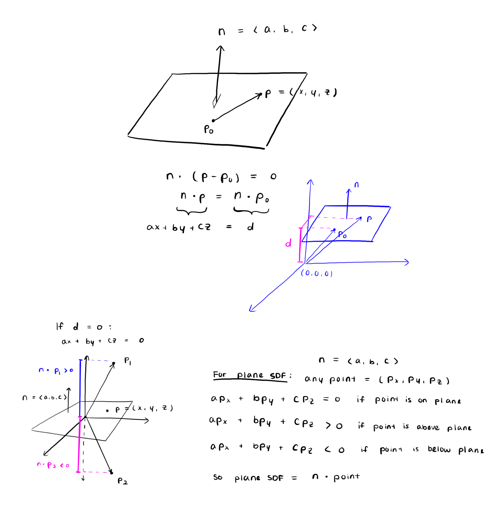
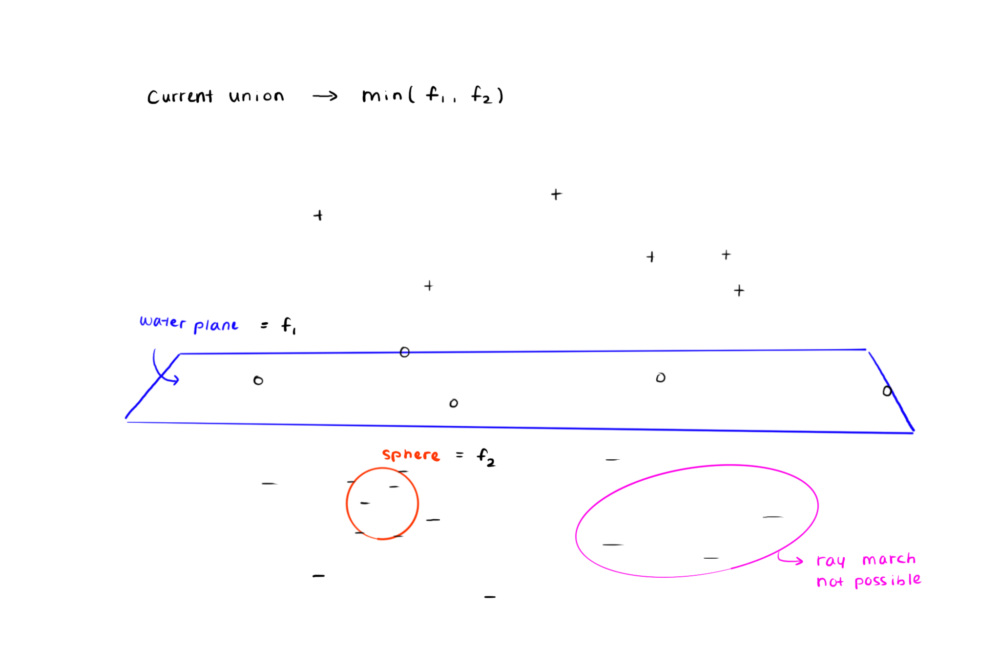
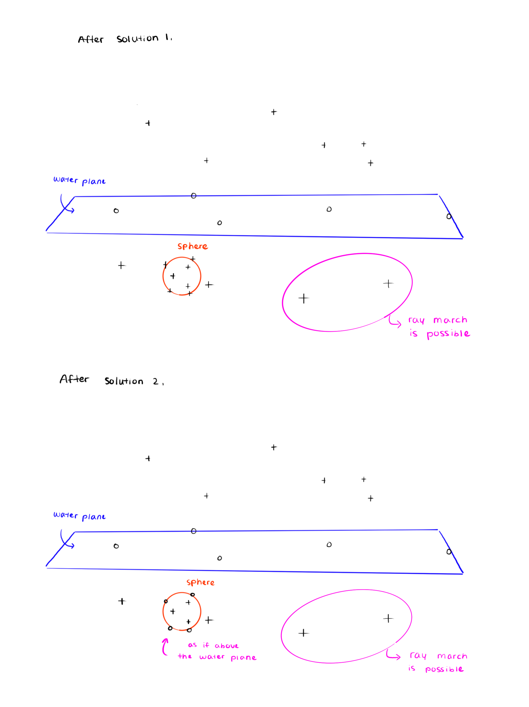

<h1>

Ray Tracing
</h1>

An implementation of ray tracing, ray marching, and signed distance functions.

- Scenes rendered using the *ShaderMaterial* provided by [three.js](https://threejs.org/)
- Lighting calculations with the *Blinn-Phong* model
- Application of simplified PBR
- Incorporation of values such as IOR and the *Fresnel* term, computed with *Schlick's* approximation

## Preview

You can also try out the [interactive demo](https://ellyhpark.github.io/Ray-tracing), as shown in the images above.

## Problems & Solutions

    

        
            
<strong>Figure 1:</strong> Deriving the plane SDF.

        </img>
        
            
<strong>Figure 2:</strong> Problem in the current union operation that returns the minimum of two SDFs, f1 and f2.

        </img>
    

    

        
            
<strong>Figure 3:</strong> Solutions to the problem shown in Figure 2.

        </img>
    

### Why can't I see under the water plane in the pool scene?
- **Analysis:**
    - As demonstrated in Figure 1, the plane SDF returns positive values for points above the plane and negative values for points below. When the camera is positioned below the plane, ray marching fails to execute properly.
    - Figure 2 illustrates the issue with the current union operation, which returns the minimum of two SDFs, and the ray marching algorithm. The approach is problematic because any point below the plane already produces a negative value, causing the union operation to return a negative result to the ray marching function. Since this negative result is less than epsilon (a small positive threshold), the algorithm incorrectly terminates the loop as an intersection case.
- **Solution 1:** As shown in the top diagram of Figure 3, I modified the approach by taking the absolute value of the union result before comparing it with epsilon. This prevents the ray marching function from misinterpreting negative values as intersections. <ins>After that, the ray was able to march!</ins>

### I add a sphere under the water plane, but why is it invisible?
- **Analysis:** Solution 1 partially resolved the issue, but it was not complete. The current union operation returns the minimal *signed* distance. This value causes the ray marching algorithm to overshoot since it should advance by the *closest* distance to the scene, potentially skipping over nearby surfaces.
- **Solution 2:** I addressed this by taking absolute values when comparing distances, making sure the union returns the closest distance to the scene. As visualized in the bottom diagram of Figure 3, this modification enabled <ins>the ray to march with correct distances, as if it is above the water plane. This made underwater objects visible!</ins>

## Contributors
Thank you [sangkunine](https://github.com/sangkunine) for your mentorship.

Pool tile texture designed by [Freepik](https://www.freepik.com).