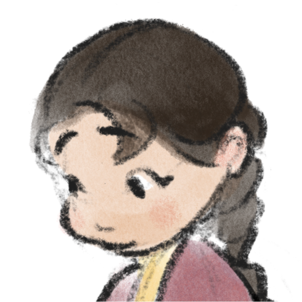
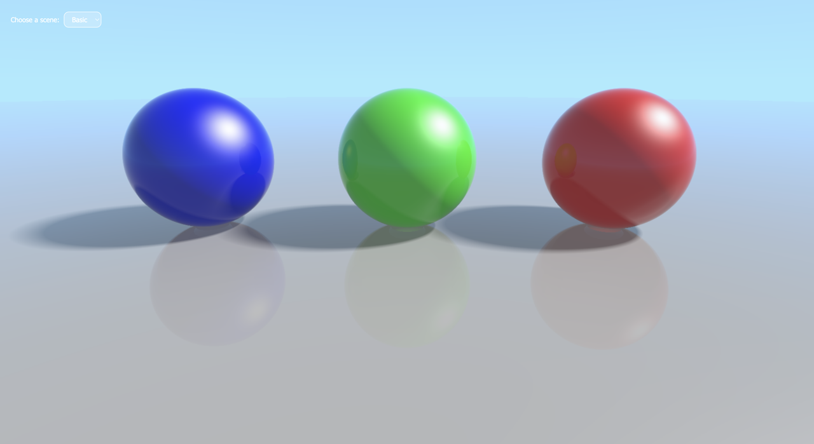

<h1>

Ray Tracing
</h1>

An implementation of ray tracing, ray marching, and signed distance functions.

- Scenes rendered using the *ShaderMaterial* provided by [three.js](https://threejs.org/)
- Lighting calculations with the *Blinn-Phong* model
- Application of simplified PBR
- Incorporation of values such as IOR and the *Fresnel* term, computed with *Schlick's* approximation

## Preview

You can also try out the [interactive demo](https://ellyhpark.github.io/Ray-tracing), as shown in the images above.

## Contributors
Thank you [sangkunine](https://github.com/sangkunine) for your mentorship.

Pool tile texture designed by [Freepik](https://www.freepik.com).